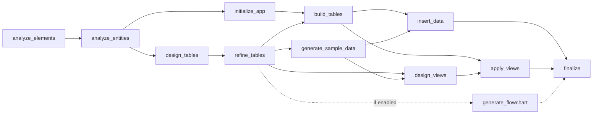

# 企业AI场景地图生成器

## 任务目标
- 本Skill用于：为企业生成AI应用场景地图报告，帮助决策者快速识别可应用的AI场景及优先级
- 核心价值：让企业老板快速知道公司哪些场景可以用AI，应该优先启动哪些
- 能力包含：
  1. 企业深度调研（公司信息、主营业务、产品、行业标签）
  2. 业务特性与流程分析
  3. 同行业AI最佳实践案例搜索
  4. AI应用场景地图生成（30+场景全量表，含优先级建议）
  5. 实施路径规划（分阶段落地计划）
  6. 报告后的系统构建规划分支（报告完成后自动进入，不等待用户主动说“阶段5”）
  7. 多维表清单中间结构生成与用户确认
  8. 通过脚本拼装批量构建请求并调用流式 API
- 触发条件：用户需要为某家企业制定AI落地规划，或想了解"我的公司如何用AI"

## 前置准备
- 依赖说明：
  - 智能体需要具备 **web-search**（网络搜索）工具能力
  - Python 3.8+（用于运行调研框架生成脚本）
  - Node.js 18+ 与 `npx`（用于调用 `basebuilder-cli` 执行批量构建）
  - 无第三方 Python 包依赖

## 操作步骤

### 核心工作流程（严格按顺序执行）

**重要：必须完成搜索后才能进入分析和报告生成阶段**

#### 阶段1：深度调研（数据收集）
**必须先完成此阶段，才能进入分析阶段**

**步骤1.1：生成调研框架**

运行脚本生成调研框架和搜索问题清单：

```bash
python scripts/deep_research_wrapper.py --company-name "<公司名称>" --country "<国家>"
```

脚本会输出：
- 企业调研框架（基础结构）
- 企业信息搜索问题清单（8个核心问题）
- 行业信息搜索问题清单（痛点 + 案例）

**步骤1.2：企业信息深度调研**

使用 **web-search** 工具，逐一搜索步骤1.1输出的「企业信息搜索问题清单」，收集以下信息：
- 公司基本信息（成立时间、规模、主营业务）
- 业务模式（B2B/B2C/平台型/混合型）
- 核心业务环节
- 关键业务流程
- 客户类型
- 业务特点
- 团队规模（如有公开信息）

**步骤1.3：行业痛点与案例收集**

使用 **web-search** 工具，按步骤1.1输出的「行业信息搜索问题清单」进行搜索（必须按顺序）：

**搜索A：行业共性痛点**
搜索关键词：`<行业> + 痛点 + 挑战 + 2024 2025`
收集内容：
- 行业面临的普遍痛点
- 典型表现和影响
- 量化数据（如有）

**搜索B：行业AI应用案例**
搜索关键词：`<行业> + AI应用 + 智能化 + 案例`
搜索关键词：`<具体业务> + AI + LLM + 实践`
收集内容：
- 至少3个标杆企业案例
- 每个案例包含：企业背景、应用场景、技术方案、实施效果、关键成功因素

**阶段1完成标志**：所有搜索完成，信息已整理成结构化文档

---

#### 阶段2：分析与诊断（仅在阶段1完成后开始）

**步骤2.1：业务特性分析**
参考 [references/business-analysis-framework.md](references/business-analysis-framework.md)，分析：
- 业务特性概述（服务模式、专业要求、业务协同、知识依赖、客户特征）
- 内部流程特点（流程特点1-4及AI赋能方向）

**步骤2.2：核心痛点诊断**
基于阶段1收集的痛点信息，分析：
- 行业共性痛点（4个）
- 企业经营痛点（效率、质量、风险、成本、知识五个维度）

**步骤2.3：对标启示总结**
基于收集的行业案例，总结：
- 4个关键启示
- 每个启示的说明和建议行动

---

#### 阶段3：场景地图生成（仅在阶段2完成后开始）

**步骤3.1：业务流程拆解**
根据企业主营业务，拆解核心业务流程，格式示例：
```
项目立项 → 预算编制&造价 → 招标代理&评标 → 合同管理&变更 → 工程结算&审计
```

**步骤3.2：AI场景全量表生成（30+场景）**
参考 [references/typical-ai-scenarios.md](references/typical-ai-scenarios.md)，生成场景全量表，包含以下列：
| 序号 | 业务环节 | AI场景名称 | 功能描述 | 实施前提 | 预期收益 | 优先级 |

**场景生成要求**：
- 场景总数必须达到30个以上
- 按业务环节分类（至少5个环节）
- 每个场景必须包含：功能描述、实施前提、预期收益、优先级（🟢/🟡/🔵）

**优先级定义**（参考 [references/scenario-priority-framework.md](references/scenario-priority-framework.md)）：
- 🟢 快速启动（0-3个月）：技术成熟、实施快、见效快
- 🟡 中期建设（3-12个月）：需要一定基础建设，价值高
- 🔵 长期演进（1年以上）：需要深度积累，战略价值高

**步骤3.3：优先级矩阵分析**
将场景按"业务价值"和"实施可行性"分类：
- 优先实施区（高价值+高可行性）
- 战略投资区（高价值+中可行性）
- 快速见效区（中价值+高可行性）
- 其他区域...

**步骤3.4：重点场景深度解读**
选择3个优先级最高的场景，详细说明：
- 场景名称
- 场景定位
- 业务痛点
- AI解决方案
- 预期收益
- 实施前提
- 实施周期
- 成功案例（如有）

---

#### 阶段4：报告生成（严格按照V2.1模板格式）

**步骤4.1：生成完整报告**
按照以下结构生成报告（严格遵循V2.1模板）：

**封面**
- 客户名称
- 报告日期
- **编制单位**：源子（深圳）人工智能有限公司（固定，不可替换）

**Part 1: 执行摘要（1页）**
- 关于客户公司
- **AI赋能的战略价值（C-level视角）**
  - 战略价值主张（三大战略价值：竞争优势升级、财务回报显著、可持续增长）
  - 战略价值量化表（5个战略维度对比）
  - 战略机会窗口（时间窗口、后发优势、差异化机会）
- 识别到的三个核心挑战（表格形式）
- AI赋能的核心价值主张
- 建议优先启动的三个场景（表格形式，含🥇🥈🥉）

**Part 2: 企业画像与业务诊断（3-4页）**
2.1 企业速写（表格）
2.2 业务价值链全景（表格，含关键活动和支撑体系）
2.3 业务特性分析（业务特性概述表格、内部流程特点表格）
2.4 核心痛点诊断（行业共性痛点表格、企业经营痛点表格）

**Part 3: 行业AI实践扫描（2页）**
3.1 行业标杆做了什么（3个案例对比表格）
3.2 对标启示：哪些可以借鉴（4个启示表格）

**Part 4: AI场景地图（5-6页）**
4.1 业务流程与AI场景总览（表格，含场景数量和优先级分布）
4.2 AI场景全量清单（30+场景表格）
4.3 场景统计汇总（统计维度表格）
4.4 优先级矩阵（3x3矩阵表格）
4.5 重点场景深度解读（3个场景卡片）

**Part 5: 实施路径建议（2页）**
5.1 分阶段落地计划（第一阶段、第二阶段、第三阶段对比表格）
5.2 关键成功要素（5个要素表格）

**Part 6: 我们如何帮助您（1页）**
6.1 服务能力矩阵（4种服务类型表格）
6.2 下一步行动建议（4个步骤表格）
6.3 **联系我们**（使用固定信息）
  - 编制单位：源子（深圳）人工智能有限公司
  - 联系人：Neil
  - 微信号：838000702
  - 微信公众号：源子AI Metainflow

**附录：模板使用指南**
- A. 如何使用本模板
- B. 质量检查清单
- C. 常见问题处理
- D. 场景扩展参考

**重要：公司信息固化**
- 封面的"编制单位"使用固定信息，不可替换
- Part 6的"联系我们"使用固定联系人信息
- 参考：[references/company-info-config.md](references/company-info-config.md)

**步骤4.2：质量检查**
生成报告后，对照以下检查项验证：
- 执行摘要是否在1页内？
- 业务特性分析是否充分？
- 痛点描述是否具体、可量化？
- 场景与痛点是否有明确对应关系？
- 场景清单是否达到30+个？
- 优先级排序是否有说服力？
- 行业案例是否与客户业务相关？
- 实施路径是否清晰、可执行？
- 是否包含完整的6个Part？

---

#### 阶段5：报告后的系统构建分支（3.0 MVP）

**强制规则：报告输出完成后，必须自动进入阶段5，不需要等待用户主动说“阶段5”或“系统构建分支”。**

阶段5是报告主链路的固定后续步骤。每次完成AI场景地图报告后，智能体都必须立即给出系统构建分支入口，并推进到系统建设意图澄清。不得在报告结束后只总结报告或等待用户主动触发下一阶段。

**步骤5.1：报告完成后自动进入系统构建规划**

报告输出完成后，不要询问用户是否“要不要继续进入系统构建规划”，而是必须自动进入系统构建分支，并开始第1轮系统建设意图澄清。

推荐表达：

- “报告部分已经完成。接下来自动进入系统构建规划分支。我会基于这份企业上下文，先确认系统目标和主要使用角色。”

如果用户明确表示不需要系统构建或要求停止，则尊重用户意图并结束系统构建分支。

**步骤5.2：单入口 + 自动模式分支**

本 Skill 保持单入口：

- 所有请求先走报告主链路
- 报告完成后，自动进入系统构建分支
- 不要求用户主动输入“阶段5”或“继续构建”才进入
- 只有用户明确拒绝或要求停止时，才结束系统构建分支

不要在报告完成后停在报告总结，也不要等待用户主动触发系统构建。

---

#### 阶段6：系统建设意图澄清（3.0 MVP）

**步骤6.1：控制在 3-4 轮内**

参考 [references/system-build-clarification.md](references/system-build-clarification.md)：

- 最多进行 3-4 轮澄清
- 信息足够时提前停止
- 每轮只补最缺的一类信息

**步骤6.2：优先补齐以下维度**

1. 系统目标
2. 主要使用角色
3. 核心业务流程
4. 当前痛点与约束
5. 是否需要流程图

**步骤6.3：澄清阶段边界**

- 不要求用户一次性填写完整 PRD
- 不生成字段级结构
- 不生成最终 API 请求 JSON
- 只为后续“多维表清单规划”补足必要上下文

---

#### 阶段7：多维表清单规划与确认（3.0 MVP）

**步骤7.1：只输出中间结构**

参考 [references/table-planning-output-schema.md](references/table-planning-output-schema.md)，只能输出以下中间结构：

```json
[
  {
    "table_name": "CRM客户管理",
    "user_requirement": "..."
  }
]
```

**关键边界：**

- 智能体只输出 `table_name` + `user_requirement`
- 智能体不输出最终 API payload
- 智能体不输出字段级 schema

**步骤7.2：用户确认表清单**

在进入构建前，必须把表清单展示给用户确认。

给用户确认时，不要直接展示 JSON。应使用自然语言或 Markdown 表格展示，推荐格式：

| 表序号 | 表名称 | 用户需求 |
|---:|---|---|
| 1 | CRM客户管理 | 记录客户基础信息、跟进状态、商机阶段，并支持销售团队协作管理。 |

也可以在对话中使用自然语言逐条展示：

```text
表序号：1
表名称：CRM客户管理
用户需求：记录客户基础信息、跟进状态、商机阶段，并支持销售团队协作管理。
```

展示给用户的是确认视图；内部仍必须保留阶段7.1规定的 `table_name` + `user_requirement` 中间结构，并在用户明确确认后交给脚本拼装最终 batch payload。

用户可进行：

- 直接确认
- 删除某张表
- 增加某张表
- 修改某张表需求描述

只有在用户明确确认后，才能进入阶段8。

---

#### 阶段8：批量构建执行（3.0 MVP）

**步骤8.1：使用脚本拼装最终请求体**

运行：

```bash
python scripts/build_batch_payload.py --input "<确认后的表清单 JSON>" --output "<batch payload 输出路径>"
```

该脚本负责：

- 生成唯一 `client_batch_id`
- 生成唯一 `client_item_id`
- 拼装最终 batch payload

**步骤8.2：构建前说明，然后使用 `npx basebuilder-cli` 执行流式构建**

在执行命令前，必须先向用户说明即将做什么、会如何反馈进度。不要在用户说“确认，开始构建”后直接静默调用 CLI。

说明完成后运行：

```bash
npx basebuilder-cli build --input "<batch payload 路径>" --json --base-url "http://127.0.0.1:1128"
```

参考 [references/batch-build-api-contract.md](references/batch-build-api-contract.md)：

- 通过 `POST /api/bitable/build/batch` 提交请求
- `basebuilder-cli` 持续消费 SSE 事件，并以 JSON Lines 输出事件
- 收到 `batch_accepted` 后记录输出中的 `request_id`，并立即向用户说明批次已接收、总表数和 request_id
- 收到 `job_progress` 后，将 `job_progress.message` 直接展示并解释给用户，例如“正在分析应用结构”“正在生成表结构”“正在创建多维表应用”
- 收到 `job_complete` 后，说明对应表的成功或失败结果；成功时展示 result.url（如有），失败时展示 error.message
- 收到 `batch_complete` 后，汇总总数、成功数、失败数和结果链接
- 如构建命令中断且已拿到 `request_id`，使用 `npx basebuilder-cli status <request_id> --json --base-url "http://127.0.0.1:1128"` 补查状态

**步骤8.3：MVP 范围限制**

参考 [references/mvp-scope-and-fallbacks.md](references/mvp-scope-and-fallbacks.md)：

- 不做失败项自动重试
- 不做本地 SQLite
- 不做历史任务中心

如果有部分表失败，只做结果告知和失败原因总结，不做自动重试。

---

### 可选分支

**分支A：快速扫描模式**
适用场景：用户希望快速了解AI应用潜力
执行策略：
- 阶段1：只做基础企业信息调研，跳过深度业务信息收集
- 阶段2：简化业务分析和痛点诊断
- 阶段3：仅生成15-20个核心场景（仅🟢优先级）
- 阶段4：生成简化版报告（仅Part 1、Part 2、Part 4摘要）

**分支B：深度规划模式**
适用场景：用户需要制定详细落地计划
执行策略：
- 阶段1：完成所有调研和信息收集，扩展到10+行业案例
- 阶段2：增加竞争对手分析、客户访谈模拟
- 阶段3：生成50+场景全量表，包含P0/P1/P2/P3四个优先级
- 阶段4：生成完整版报告 + 实施详细方案 + ROI测算

**分支C：特定领域聚焦模式**
适用场景：用户关注特定业务领域（如客服、研发、营销）
执行策略：
- 阶段1：企业调研，重点收集该领域信息
- 阶段2：分析聚焦于该领域
- 阶段3：场景全量表中该领域场景占比60%以上
- 阶段4：报告中突出该领域，Part 4重点场景深度解读全部选择该领域

---

## 资源索引

### 必要脚本
- [scripts/deep_research_wrapper.py](scripts/deep_research_wrapper.py)
  - 用途：生成企业调研框架和搜索问题清单
  - 参数：`--company-name`（必需）、`--country`（默认"中国"）、`--format`（markdown/json，默认markdown）
  - 依赖：Python 3.8+，无第三方包依赖
- [scripts/build_batch_payload.py](scripts/build_batch_payload.py)
  - 用途：将确认后的表清单拼装为 batch build API 请求体
  - 参数：`--input`、`--output`、`--language`、`--with-generate-flowchart`、`--prompt-variant`
  - 依赖：Python 3.8+，无第三方包依赖

### 外部命令
- `npx basebuilder-cli build --input <batch payload 路径> --json --base-url http://127.0.0.1:1128`
  - 用途：提交 batch build 请求、消费 SSE、输出 JSON Lines 进度事件
  - 依赖：Node.js 18+ 与 `npx`
- `npx basebuilder-cli status <request_id> --json --base-url http://127.0.0.1:1128`
  - 用途：构建命令中断后，根据已知 `request_id` 补查状态
  - 依赖：Node.js 18+ 与 `npx`

### 领域参考
- [references/company-info-config.md](references/company-info-config.md)
  - 何时读取：始终（公司信息固化配置）
  - 内容：源子AI公司信息配置（名称、联系人、微信），报告自动使用
- [references/report-template-v2.1.md](references/report-template-v2.1.md)
  - 何时读取：阶段4步骤4.1
  - 内容：V2.1报告完整模板，包含6个Part的详细格式要求和示例
- [references/business-analysis-framework.md](references/business-analysis-framework.md)
  - 何时读取：阶段2步骤2.1
  - 内容：业务特性分析框架、流程特点分析维度
- [references/industry-case-template.md](references/industry-case-template.md)
  - 何时读取：阶段1步骤1.3
  - 内容：行业案例输出格式模板、字段填写说明
- [references/scenario-priority-framework.md](references/scenario-priority-framework.md)
  - 何时读取：阶段3步骤3.2
  - 内容：优先级评估标准（P0/P1/P2）、评估流程、评估工具表
- [references/typical-ai-scenarios.md](references/typical-ai-scenarios.md)
  - 何时读取：阶段3步骤3.2
  - 内容：8大行业（建筑、电商、金融、制造、医疗、教育、法律、物流）的典型AI场景参考库
- [references/system-build-clarification.md](references/system-build-clarification.md)
  - 何时读取：阶段6
  - 内容：系统建设意图澄清目标、轮次控制、提前停止条件
- [references/table-planning-output-schema.md](references/table-planning-output-schema.md)
  - 何时读取：阶段7
  - 内容：中间表清单唯一允许的输出结构与正反例
- [references/batch-build-api-contract.md](references/batch-build-api-contract.md)
  - 何时读取：阶段8
  - 内容：batch build API 请求格式、SSE 事件、状态补查方式
- [references/mvp-scope-and-fallbacks.md](references/mvp-scope-and-fallbacks.md)
  - 何时读取：阶段8
  - 内容：MVP 不做范围、流中断兜底文案、部分失败告知方式

### 输出资产
- 无固定模板，报告由智能体基于V2.1模板和用户案例动态生成

## 注意事项

### 执行顺序要求（强制）
1. **必须先完成阶段1（深度调研）的所有搜索**，才能进入阶段2分析
2. **必须先完成阶段2（分析诊断）**，才能进入阶段3场景生成
3. **必须先完成阶段3（场景地图）**，才能进入阶段4报告生成
4. 报告完成后，必须自动进入阶段5-8的系统构建分支；无需用户主动说“阶段5”或“继续构建”；如果用户明确拒绝或要求停止，则结束系统构建分支
5. 严禁跳过搜索阶段直接生成报告

### 工具依赖要求
1. **web-search**：智能体必须具备网络搜索能力，用于企业信息调研和行业案例收集
2. `deep_research_wrapper.py` 仅生成调研框架，实际调研工作由智能体通过 web-search 完成
3. batch payload 必须通过 `build_batch_payload.py` 生成，不要在对话中手写最终请求 JSON
4. batch build 执行必须通过 `npx basebuilder-cli` 完成，不要使用对话内手写 HTTP/SSE 逻辑

### 快速扫描模式修正要求

当用户明确说“快速扫描版”“快速扫描”“先快速看一下”时，执行快速扫描模式：
- 阶段1：只做基础企业信息调研，允许在公开信息不足时明确标注假设，不强制完成全部8个企业问题和3个行业案例
- 阶段2：简化业务分析和痛点诊断
- 阶段3：生成15-20个核心场景，不要求30+场景
- 阶段4：生成简化版报告，只保留Part 1、Part 2、Part 4摘要和必要实施建议
- 阶段5：报告完成后仍必须自动进入系统构建分支

快速扫描模式下，不要机械套用完整版的“30+场景、3个案例、6个Part、15-20页”要求。必须在报告中说明“这是快速扫描版，结论基于公开信息和合理业务假设，后续可升级为深度规划版”。

### 内容质量要求
1. **场景数量**：完整版AI场景全量表必须达到30个以上；快速扫描版生成15-20个核心场景即可
2. **行业案例**：完整版必须至少收集3个与客户业务相关的标杆案例；快速扫描版可简化为行业实践方向或1-3个轻量案例，公开信息不足时需标注假设
3. **痛点量化**：所有痛点描述必须包含具体、可量化的影响
4. **优先级合理**：优先级排序必须有充分依据（业务价值、实施可行性、预期收益）
5. **格式严格**：报告必须严格按照V2.1模板的6个Part结构生成

### 数据验证要求
1. 企业信息必须至少通过两个来源交叉验证
2. 行业案例必须来自权威来源（官方报道、行业报告、知名媒体）
3. 痛点和收益数据必须有具体数字或可量化的描述
4. 技术方案描述必须准确、专业

## 阶段8执行交互规范（必须遵守）

在用户确认表清单并说“确认，开始构建”后，智能体不能立即静默调用 `npx basebuilder-cli`。必须先向用户说明接下来将执行什么、会产生什么、如何反馈进度，然后再执行构建命令。

构建前必须说明：
- 已确认的表数量
- 即将先用 `build_batch_payload.py` 生成批量构建请求体
- 随后用 `npx basebuilder-cli build` 提交到本地构建服务
- CLI 会实时返回 JSON Lines 事件，包括 batch_accepted、job_progress、job_complete、batch_complete
- 智能体会把关键进度翻译成人能看懂的说明，而不是只沉默等待最终结果
- 如果拿到 request_id，会记录它用于中断后的状态补查

推荐表达：

“收到确认。接下来我会执行三步：1）把这 N 张表的自然语言需求写入中间清单；2）调用脚本生成批量构建 payload；3）用 basebuilder-cli 提交构建。构建过程中 CLI 会持续返回进度事件，我会把关键阶段实时解释给你，例如：批次已接收、正在分析应用结构、正在识别业务实体、正在创建多维表应用、正在生成表结构、单表完成、批次完成。现在开始执行。”

进度反馈要求：
- 收到 `batch_accepted`：必须告诉用户批次已接收、总表数、request_id
- 收到 `job_progress`：必须提取 `message`，并结合 `client_item_id` 或表名说明当前正在做什么
- 收到 `job_complete`：必须说明该表成功或失败；成功时给出 result.url（如有）；失败时给出 error.message
- 收到 `batch_complete`：必须汇总总数、成功数、失败数和结果链接
- 如果长时间只有 keepalive：说明“构建仍在运行，最后阶段是……”，不要误判失败
- 如果用户中途要求停止：终止本地 CLI 监听进程，并用 request_id 查询一次后端状态，解释本地监听停止不等于后端任务取消

注意：这里的“实时反馈”是指在工具调用可观察范围内尽可能增量报告关键事件；不要只在最后给一句完成总结。
1. 智能体只生成中间表清单，不生成最终 API payload
2. 执行状态以 API 返回和状态查询接口为准，不以对话记忆为准
3. MVP 阶段不做失败项自动重试
4. 流中断后，如已拿到 `request_id`，优先调用状态查询接口补查

### 报告生成原则
1. **客户视角**：整个报告要以客户为中心，让客户感受到"你懂我的业务"
2. **价值导向**：每个场景都要明确说明预期收益和价值主张
3. **可操作性**：实施路径和建议必须清晰、可执行
4. **差异化引导**：自然引导到咨询服务，避免生硬推销

## basebuilder-cli 构建阶段解释参考

当 `npx basebuilder-cli build` 返回 `job_progress.stage/sub_stage` 时，按以下流程向用户解释当前进度。构建流程大致为：



阶段说明：

| 阶段/子阶段 | 含义 | 给用户的解释 |
|---|---|---|
| analyze_elements | 分析应用结构 | 构建服务正在理解这张表/应用需要包含哪些核心模块和业务元素。 |
| analyze_entities | 识别业务实体 | 正在从自然语言需求中识别关键业务对象，例如客户、项目、任务、模板、复购机会等。 |
| initialize_app | 创建多维表应用 | 正在创建飞书多维表应用容器，进入实际应用创建阶段。 |
| design_tables | 准备表结构设计 | 正在初步设计需要哪些数据表以及表之间的大致关系。 |
| refine_tables | 生成/细化表结构 | 正在细化字段、字段类型、关联关系等表结构细节。 |
| build_tables | 创建数据表 | 正在把设计好的表结构真正创建到多维表应用中。 |
| generate_sample_data | 生成示例数据 | 正在为表生成样例记录，方便打开后理解系统如何使用。 |
| design_views | 设计视图 | 正在设计表格视图、看板视图、分组/筛选等使用视图。 |
| insert_data | 写入示例数据 | 正在把生成的样例记录插入到已创建的数据表中。 |
| apply_views | 应用视图配置 | 正在把设计好的视图配置应用到多维表中。 |
| generate_flowchart | 生成流程图 | 如果启用流程图，正在生成业务流程图或系统流程图。 |
| finalize | 收尾完成 | 正在做最终检查、汇总结果并准备返回应用链接。 |

进度解释规则：
- 优先使用 CLI 返回的 `message` 原文，再补充以上阶段解释。
- 如果同时出现多个 item 并行运行，按“已完成/运行中/待执行”汇总，不要逐条刷屏。
- 当任务处于 `generate_sample_data`、`design_views`、`insert_data`、`apply_views` 时，说明应用主体通常已经创建，正在补充可用性配置。
- 当任务到 `finalize` 时，说明即将返回结果链接。

## 使用示例

### 示例1：建筑工程公司完整报告生成

**功能说明**：为"深圳市航建工程造价咨询有限公司"生成完整的AI场景地图报告

**执行方式**：
1. **阶段1：深度调研**
   - 执行脚本：`python scripts/deep_research_wrapper.py --company-name "深圳市航建工程造价咨询有限公司" --country "中国"`
   - 使用 web-search 逐一搜索脚本输出的问题清单
   - 搜索"建筑工程行业痛点"
   - 搜索"工程造价 AI应用案例"、"招标代理 智能化"等

2. **阶段2：分析诊断**
   - 分析业务特性：全过程投资控制、高度专业性、多业务协同
   - 诊断核心痛点：效率瓶颈、经验传承难、合规风险高
   - 总结对标启示：数据基础、标准化切入、人机协同、场景驱动

3. **阶段3：场景地图**
   - 业务流程拆解：项目立项 → 预算编制&造价 → 招标代理&评标 → 合同管理&变更 → 工程结算&审计
   - 生成32个AI场景（预算编制7个、招标代理5个、合同管理5个、工程结算6个、支撑体系7个）
   - 优先级分类：🟢快速启动9个、🟡中期建设22个、🔵长期演进1个
   - 重点场景：AI造价知识库、AI标书智能审核、AI政策法规解析

4. **阶段4：报告生成**
   - 生成完整V2.1格式报告（6个Part）
   - Part 1执行摘要：3个核心挑战、3个优先启动场景（🥇AI造价知识库、🥈AI标书智能审核、🥉AI政策法规解析）
   - Part 4包含32个场景全量表和优先级矩阵

**关键输出**：
- 完整报告：约15-20页
- 场景清单：32个AI应用场景
- 实施路线图：3个阶段落地计划

---

### 示例2：电商公司快速扫描

**功能说明**：为电商平台快速生成AI应用场景摘要，并在报告完成后自动进入系统构建规划澄清。

**执行方式**：使用快速扫描模式
- 阶段1：基础企业调研（web-search）
- 阶段2：简化分析
- 阶段3：仅生成18个🟢优先级场景
- 阶段4：生成简化版报告（仅Part 1、Part 2、Part 4摘要）

**输出**：5-8页摘要报告

---

### 示例3：制造企业深度规划

**功能说明**：为制造企业制定详细的AI落地规划

**执行方式**：使用深度规划模式
- 阶段1：扩展到10+行业案例（web-search）
- 阶段2：增加竞争对手分析
- 阶段3：生成50+场景
- 阶段4：完整报告 + 实施详细方案 + ROI测算

**输出**：20-30页详细报告

---

### 示例4：聚焦智能客服领域

**功能说明**：为某企业聚焦生成智能客服领域的AI场景地图

**执行方式**：使用特定领域聚焦模式（客服领域）
- 阶段1：企业调研 + 客服领域信息收集（web-search）
- 阶段2：聚焦客服业务分析
- 阶段3：生成30个场景，其中客服领域场景20个（占比67%）
- 阶段4：报告中客服领域占比60%，Part 4重点场景全部为客服场景

**输出**：聚焦客服的完整报告
